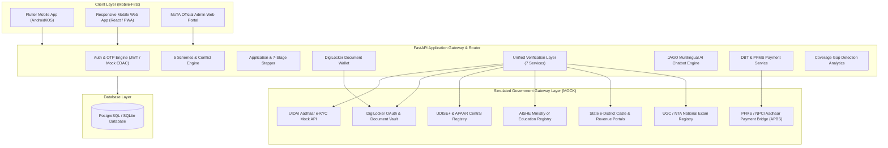

# System Architecture: MoTA Unified ST Scholarship & Fellowship Platform

## 1. High-Level Architecture Overview

The **Unified ST Scholarship & Fellowship Platform** for the **Ministry of Tribal Affairs (MoTA), Government of India**, is architected as an event-driven, decoupled system that integrates disparate national verification registries and DBT payment systems into a single mobile-first interface for Scheduled Tribe students.

---

## 2. Component Breakdown

### 2.1 Student Interface (Mobile-First)
- **Unified 5-Scheme Dashboard**: Delivers consolidated visibility over Pre-Matric, Post-Matric, Top Class, NFST, and NOS schemes.
- **DigiLocker Digital Wallet**: Stores verified caste certificates, PVTG certifications, marksheets, and income declarations with tamper-evident digital URIs.
- **JAGO AI Assistant**: Multi-lingual conversational agent (English and Hindi) offering contextual answers directly tied to the student's live application and payment status.
- **7-Stage Visual Timeline**: Tracks progress: *Application Submitted $\rightarrow$ Document Verification $\rightarrow$ Institute Verification $\rightarrow$ State/Authority Verification $\rightarrow$ Sanction $\rightarrow$ DBT Processing $\rightarrow$ Payment Completed*.

### 2.2 Unified Verification Layer
Simulates 7 critical government interfaces with automated status responses (`Verified`, `Invalid`, `Mismatch`, `Pending`, `Manual Review`):
1. `/verify/identity`: UIDAI Aadhaar demographic and biometric OTP authentication.
2. `/verify/st-certificate`: State e-District portal validation for ST and PVTG status.
3. `/verify/income`: State Revenue department validity check ($\le$ ₹2.5L or ₹6.0L).
4. `/verify/education`: UDISE+ and Academic Bank of Credits (ABC) marksheet check.
5. `/verify/institution`: AISHE code validity and active accreditation check.
6. `/verify/net-jrf`: UGC/NTA scorecard validation for NFST candidates.
7. `/verify/disability`: UDID national disability registry check.

**Fail-Safe Routing Rule:** If automated verification fails or reports a data mismatch, the application is **never** automatically rejected; it is routed to the **MoTA Officer Manual Review Queue** with a deficiency flag sent to the student.

### 2.3 Scheme Conflict Prevention Engine
Enforces the Ministry's rule that Scheduled Tribe students can avail only one scholarship/fellowship at a time. Intercepts conflicting applications and presents a clear policy warning with transition guidance.

### 2.4 Coverage Gap Detection Analytics
Cross-references:
- **UDISE+ & AISHE**: Enrolled ST student count in a district/institute.
- **MoTA Database**: Active scholarship beneficiaries.
- **Potentially Eligible**: Identifies students enrolled in education but not receiving scholarships, classifying them as *"Potentially Eligible"* pending official verification, and scheduling proactive Common Service Center (CSC) outreach camps.
