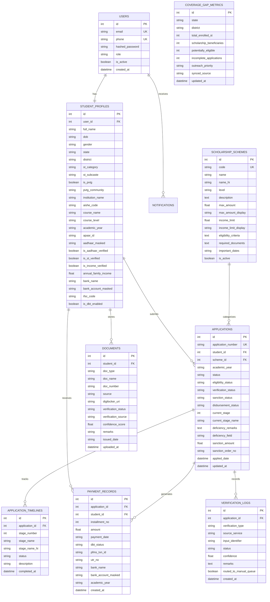

# Database Entity-Relationship Diagram (ERD)

The database schema is designed for relational consistency and auditability, supporting PostgreSQL and SQLite.

## 1. Mermaid Entity-Relationship Diagram

---

## 2. Security & Masking Standards
- **Aadhaar Storage**: In compliance with UIDAI and DPDP Act guidelines, no raw 12-digit Aadhaar number is stored in the database. Only masked representations (`XXXX-XXXX-8921`) and encrypted verification tokens are stored.
- **Bank Account Details**: Displayed masked as `XXXXXXXX4291` in client payloads to preserve student privacy during public demonstrations.
